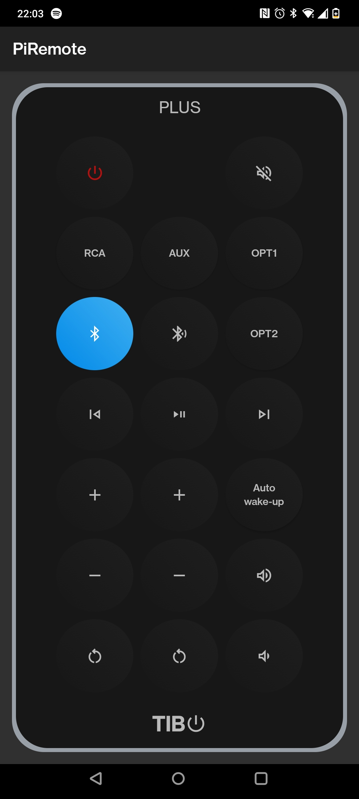

# PiRemote

## Description

This is a simple application that emulates the IR controller for the [TIBO Plus 3 speakers](https://the-gadgeteer.com/2016/02/06/tibo-plus-3-active-speaker-system-wbluetooth-review/).

The app is used in conjunction with [PiRemoteServer](https://github.com/dc-gh/PiRemoteServer). It connects to the server on the default address https://192.168.1.90:5000 and sends JSON requests. The server translates these requests into IR requests and sends them out of the [Pi-Mote IR blaster](https://energenie4u.co.uk/catalogue/product/ENER314-IR).
